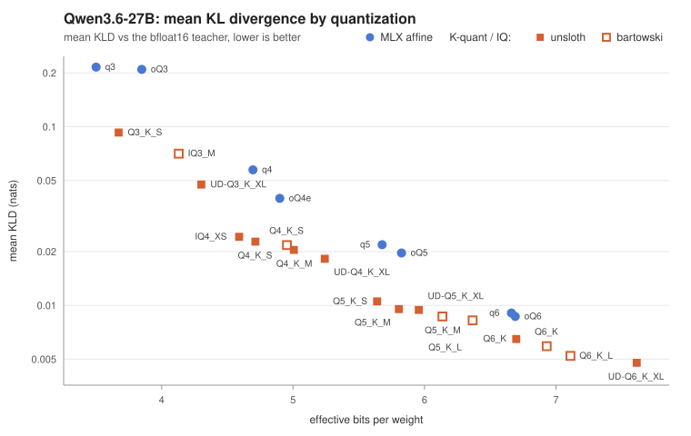

# Qwen3.6-27B: 26 quantizations, one ranking

Every published quantization of Qwen3.6-27B available at the time, from six
publishers, in both MLX and GGUF, scored against one bfloat16 teacher under one
protocol. Because teacher and student run the same MLX forward implementation,
a GGUF and an MLX checkpoint can sit in the same ranking.



Full table: [comparison.md](comparison.md). Underlying records:
[records/](records/).

## Top of the table

| student | publisher | format | bpw | mean KLD +/- se | p99 | top-1 |
|---|---|---|---:|---:|---:|---:|
| `Qwen3.6-27B-UD-Q6_K_XL.gguf` | unsloth | gguf | 7.615 | 0.0048 +/- 0.0003 | 0.0258 | 98.01% |
| `Qwen_Qwen3.6-27B-Q6_K_L.gguf` | bartowski | gguf | 7.110 | 0.0052 +/- 0.0002 | 0.0268 | 97.94% |
| `Qwen_Qwen3.6-27B-Q6_K.gguf` | bartowski | gguf | 6.929 | 0.0059 +/- 0.0003 | 0.0278 | 97.64% |
| `Qwen3.6-27B-Q6_K.gguf` | unsloth | gguf | 6.698 | 0.0065 +/- 0.0004 | 0.0312 | 97.52% |
| `Qwen_Qwen3.6-27B-Q5_K_L.gguf` | bartowski | gguf | 6.366 | 0.0082 +/- 0.0003 | 0.0557 | 97.11% |
| `deepsweet__Qwen3.6-27B-MLX-oQ6` | deepsweet | mlx-affine | 6.690 | 0.0087 +/- 0.0004 | 0.0523 | 97.16% |

The bf16 teacher scored against itself heads the full table at 0.0018 nats. That
row is the measurement floor rather than a result, and the table marks it `(f)`.

## Things the table shows

**Bit width does not determine quality.** At roughly 4.9 bits per weight,
`Qwen_Qwen3.6-27B-Q4_K_S` scores 0.0217 nats while `Jundot__Qwen3.6-27B-oQ4e-mtp`
at 4.898 bpw scores 0.0397, nearly twice the divergence for the same size. What
gets spent where matters more than how much is spent.

**The same quant name is not the same quant.** unsloth's `Q5_K_M` is 5.805 bpw
and bartowski's is 6.136 bpw, a third of a bit apart with matching differences
in score. That is why `compare --publisher` exists.

**Tails degrade faster than means.** From Q6_K_XL to Q3_K_S the mean KLD grows
19x while p99 grows 40x. Mean divergence understates how bad the worst tokens
get, which is where generation visibly derails.

## Reproducing this

```bash
# One score per student. The first pays the teacher forward pass and writes
# the ~51.5 GB cache entry. Each later student replays it.
mlx-kld score <teacher-path> <student-path>

mlx-kld compare --publisher --scored-bpw
mlx-kld plot --log-y --svg kld-vs-bpw-log.svg
```

## Caveats

These numbers came from one machine, one corpus, one seed. They are comparable
against each other because they share a calibration spec, which the table states
in full and which every record pins with a content hash of the exact scored
token stream. They are not comparable against llama.cpp's published KL figures,
which use a different engine, teacher, and windowing.

`scored bpw` in the full table counts only the weights the scoring pass loads,
excluding any multi-token-prediction stack or vision tower that never
contributes a logit. Where it sits below the headline bpw, the checkpoint is
spending bits on weights this measurement never sees. The gap reaches 5.4% on
`bearzi__Qwen3.6-27B-oQ3` and 2.4% on `mlx-community__Qwen3.6-27B-6bit`. Four
records predate the field and show `n/a`.
